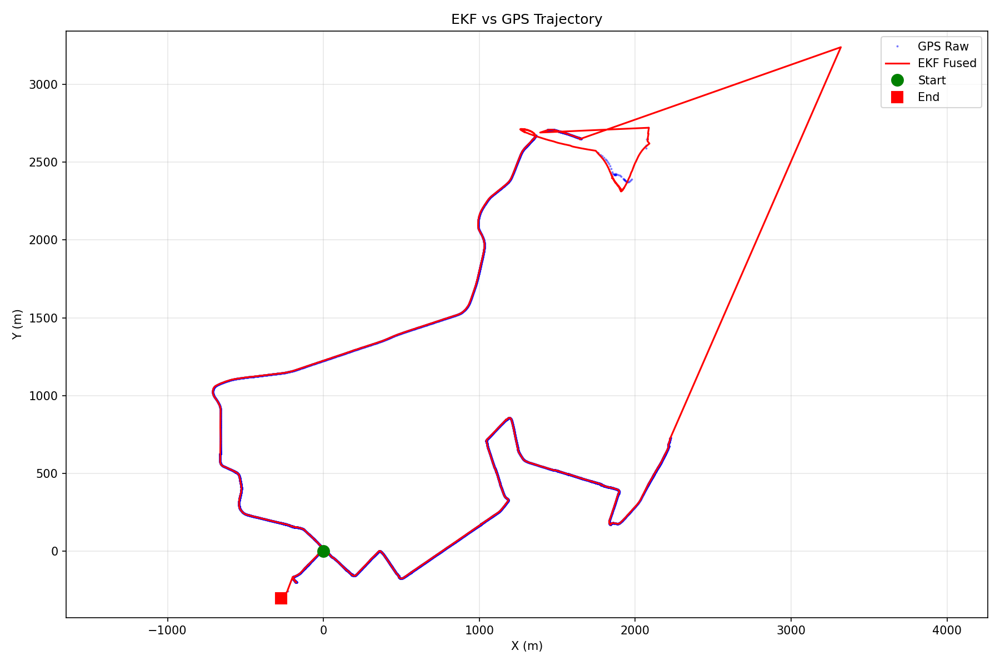
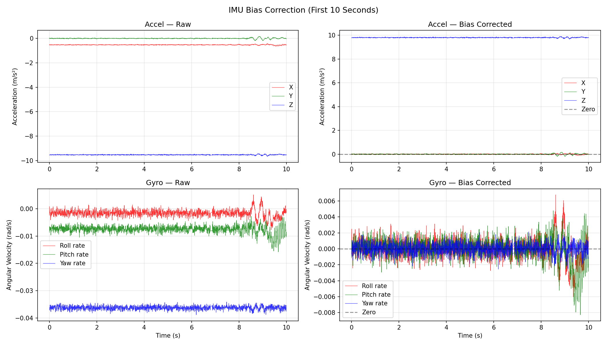

# GPS-IMU Sensor Fusion with Extended Kalman Filter

6-DoF EKF fusing GPS (10Hz) and IMU (200Hz) for continuous vehicle localization over a 16.5km urban drive with extended GPS outages.

---

## Problem

GPS operates at 10Hz with meter-level noise and drops out entirely in urban canyons and tunnels. IMU runs at 200Hz but drift accumulates unboundedly; errors compound with every integration step. Deploying either sensor alone is not an option for reliable vehicle localization.

This is the fundamental challenge in field robotics, bridging the gap between a fast but drifting sensor and a slow but globally accurate one. The EKF solves this: continuous 200Hz state estimation driven by IMU, with GPS corrections applied optimally weighted by each sensor's real-world uncertainty — keeping localization alive through the outages that break single-sensor systems.

Building robust perception systems that work in real-world conditions — not just in simulation — is the engineering problem that matters. This project is a direct demonstration of that: diagnosing real sensor failures, empirically characterizing noise, and engineering a fusion system that maintains reliable localization across a 16.5km urban drive with 500+ seconds of GPS outage.

---

## Approach

**State vector:** `[x, y, theta, vx, vy, omega]`

**Process model:** Constant velocity with gyroscope-driven heading. Position integrates Cartesian velocity, heading integrates gyro angular rate. State transition matrix F propagates uncertainty forward.

**Measurement model:** GPS provides `[x, y]` in UTM coordinates. Measurement noise R derived empirically from GPS position differences — captures actual multipath and DOP effects during collection.

**IMU bias removal:** First 10 seconds used for bias estimation (vehicle stationary, GPS not yet acquired). Gravity subtracted from Z axis explicitly.

**GPS outage handling:** During dropout periods only prediction runs — P grows continuously. On GPS reacquisition, large P produces large Kalman gain, snapping estimate back to ground truth.

---

## Results

| Metric | Value |
|---|---|
| Mean error | 154.3 m |
| RMS error | 423.4 m |
| Max error | 1762.7 m |
| Mean speed | 4.84 m/s (17.4 km/h) |
| Duration | 44.7 min |
| Distance | 16.5 km |

GPS had two extended outages — 273.5 seconds at startup and ~250 seconds mid-drive. RMS and max error are dominated by these windows. Mean error of 154m is across the full 44 minute drive.

GPS measurement noise: `sigma_x = 5.9m, sigma_y = 13.0m` — asymmetric noise from satellite geometry (DOP) during collection.

---

## Results Visualization

**EKF vs GPS Trajectory** — fused output at 200Hz vs raw GPS at 10Hz. Divergence visible during the two GPS outage windows.



**IMU Bias Correction** — raw vs corrected accelerometer and gyroscope over the 10 second stationary window. X and Y axes collapse to ~0 after correction.



---

## Structure

```
gps-imu-ekf-localization/
├── src/
│   ├── extract_pkl.py        # extract ROS2 bag to pkl
│   ├── bias_estimation.py    # IMU bias estimation and removal
│   ├── process_model.py      # process model, F matrix, Q matrix
│   ├── measurement_model.py  # H matrix, R matrix, correction step
│   ├── kalman_filter.py      # initialization and main EKF loop
│   └── utils.py              # UTM conversion, angle normalization
├── ekf/
│   └── ekf_localization.py   # main script — runs full pipeline
├── results/figures/          # output plots
└── data/
    └── README.md             # data instructions
```

---

## Run

```bash
# Step 1 — extract ROS2 bag to pkl (run once)
python3 src/extract_pkl.py

# Step 2 — run EKF pipeline
python3 ekf/ekf_localization.py
```

**Dependencies:** `numpy`, `matplotlib`, `utm`, `rclpy` (for bag extraction only)

```bash
pip install numpy matplotlib utm
```

---

## Data

Place ROS2 bag in `data/` and update `BAG_PATH` in `src/extract_pkl.py`.

Topics used:
- `/gps/fix` — `sensor_msgs/NavSatFix` @ 10Hz
- `/imu/imu_uncompensated` — `sensor_msgs/Imu` @ 200Hz

Raw bag and pkl files are excluded from the repo (see `.gitignore`).
